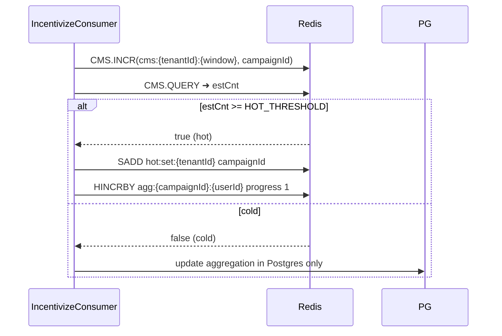

# ProjectLLD.md
[CREATED 2025-06-27]

Low-level design (LLD) for the Incentivization Platform covering:
1. External & internal APIs (REST + streaming).  
2. Consumer interfaces (Kafka topic contracts, CDC streams).  
3. Database schemas (Postgres & Redis) with indexing strategy.

---
## 1. REST APIs
### 1.1 Tenant On-boarding
| Method | Path | Request Body | Response | Notes |
|--------|------|--------------|----------|-------|
| POST | `/api/v1/tenants` | `TenantCreateDTO` | `TenantDTO` (201) | Creates tenant & default limits |
| GET  | `/api/v1/tenants/{tenantId}` | – | `TenantDTO` | |

### 1.2 Limit Management
| Method | Path | Description |
| POST | `/api/v1/tenants/{tenantId}/limits` | Upsert tenant-wide limits |
| POST | `/api/v1/tenants/{tenantId}/user-limits` | Upsert per-user limits |
| GET  | `/api/v1/tenants/{tenantId}/limits` | Fetch effective limits |

### 1.3 Campaign Management (CMS)
| Method | Path | Description |
| POST | `/api/v1/campaigns` | Create campaign (SIMPLE / QUEST) |
| PUT  | `/api/v1/campaigns/{campaignId}` | Update campaign |
| GET  | `/api/v1/campaigns/{campaignId}` | Fetch campaign |
| GET  | `/api/v1/tenants/{tenantId}/campaigns` | List campaigns with filters |
| POST | `/api/v1/campaigns/{campaignId}:activate` | Activate campaign |
| POST | `/api/v1/campaigns/{campaignId}:pause` | Pause campaign |

### 1.4 Cohort Service
| Method | Path | Description |
| POST | `/api/v1/cohorts` | Create static/dynamic cohort |
| GET  | `/api/v1/cohorts/{cohortId}` | Fetch cohort |
| POST | `/api/v1/cohorts/{cohortId}:recompute` | Recompute dynamic cohort |

### 1.5 DCM Push Endpoint (Internal)
DCM subscribes to `incentive-generated` topic; additionally exposes
`wss://dcm.{env}.svc/ws` WebSocket where clients authenticate via JWT and receive JSON payload:
```json
{
  "type": "INCENTIVE_NOTIFICATION",
  "incentiveId": "uuid",
  "campaignId": "uuid",
  "reward": {
    "currency": "POINTS",
    "amount": 50
  },
  "issuedAt": "2025-06-27T12:34:56Z"
}
```

---
## 2. Streaming / Consumer Interfaces
### 2.1 Event Bus Topics
| Topic | Key | Value Schema | Producer | Consumer |
|-------|-----|--------------|----------|----------|
| `tenant-events` | `tenantId` | `ActionEvent` Avro | Mobile / backend services | IC |
| `incentive-generated` | `userId` | `IncentiveEvent` Avro | IC | DCM, CDC connector |

### 2.2 CDC Streams (Debezium)
| Source Table | Out Topic | Downstream |
|--------------|-----------|------------|
| `incentives` | `db.incentives` | Analytics Bay (BigQuery/Snowflake) |
| `incentives` | `db.incentives.redis` | Redis Aggregation Pipeline |

Debezium config uses Postgres WAL, `snapshot.mode=schema_only`.

---
## 3. Database LLD
### 3.1 Postgres (ic_db)
```
TENANT (tenant_id PK, name, created_at, status)
USER   (user_id PK, tenant_id FK, external_ref, created_at)
ACTION (action_code PK, description)
CAMPAIGN (
  campaign_id PK, tenant_id FK,
  name, type ENUM(SIMPLE, QUEST),
  start_at, end_at, status ENUM(DRAFT, ACTIVE, PAUSED, ENDED),
  rule_json JSONB,
  cohort_id FK NULL,
  created_at
)
LIMIT (
  limit_id PK, tenant_id FK, scope ENUM(GLOBAL, USER),
  max_per_day, max_total, window_days,
  created_at
)
EVENT (
  event_id PK, tenant_id FK, user_id FK,
  action_code FK, event_ts, payload JSONB
)
INCENTIVE (
  incentive_id PK, type ENUM(CASHBACK, POINTS, COUPON),
  reward_currency, reward_amount NUMERIC
)

USER_AGGREGATION (
  id PK, user_id FK, campaign_id FK,
  action_code, incentive_id FK NULL,
  completed_at TIMESTAMP
)

CAMPAIGN (
  campaign_id PK, tenant_id FK,
  name, type ENUM(SIMPLE, QUEST),
  start_at, end_at, status ENUM(DRAFT, ACTIVE, PAUSED, ENDED),
  rule_json JSONB,   -- includes cohort rule when present
  created_at
)
-- Existing tables --
INCENTIVE_EVENT_LOG (
  incentive_id FK, user_id FK, published_at TIMESTAMP
)

```
Indexes: composite `(tenant_id, status)` on CAMPAIGN; GIN on `rule_json`; `(user_id, issued_at desc)` on INCENTIVE.

### 3.2 Redis (limits)
Key patterns:
* `limit:{tenantId}:daily` → integer (INCR with TTL 1d)  
* `limit:{tenantId}:{userId}:daily` → integer  
Lua script ensures atomic check + increment.


---
## 4. Interfaces Between Components
| Caller | Callee | Interface |
|--------|--------|-----------|
| IC | CMS | REST (Feign client) – `/campaigns/search?tenantId=&action=` |
| IC | Redis Limits | Lua scripts via Jedis – `CHECK_AND_INCR` |
| IC | IC DB | jOOQ generated DAOs |
| DCM | Broker | Kafka consumer `incentive-generated` |

---
## 5. Sequence – SIMPLE Incentive (Detailed)
1. **Event Svc** ▶ **Broker**: publish `ActionEvent`.
2. **IC** consumes event ➜ `CMS /campaigns/search`.
3. IC evaluates rule; calls Redis script to check limits.
4. IC writes `INCENTIVE` row; commit triggers Debezium.
5. IC publishes `IncentiveEvent` on `incentive-generated` topic.
6. **DCM** pushes WS frame to client.
7. (reserved) External analytics integration – out of current scope.

---
## 6. Hot Campaign Optimisation Using Count-Min Sketch

### 6.1 Rationale
High-traffic ("hot") campaigns generate a disproportionate share of events. Storing every per-user aggregation for **all** campaigns in Redis wastes memory. We introduce a **Count-Min Sketch (CMS)** based filter to cheaply approximate campaign frequencies in the current sliding window and persist detailed user aggregates *only* for campaigns whose estimated frequency exceeds a threshold.

Advantages of CMS in this context:
1. **Memory efficiency** – O(w·d) counters (e.g. 2 kB for 0.01 error @ 99% confidence) instead of hash per campaign.
2. **Speed** – constant-time updates & queries (HSET pipeline / Lua) suitable for 10^5 events/s.
3. **Probabilistic upper-bound** – CMS never under-estimates, preventing false negatives in hot-campaign detection.
4. **Simplicity** – fits into existing Redis deployment; no external service required.

### 6.2 Data Structures
| Redis Key | Type | TTL | Description |
|-----------|------|-----|-------------|
| `cms:{tenantId}:{windowTs}` | **CMS** (implemented as hash table array) | 10 min | Rolling sketch of <campaignId,count> for the window.|
| `hot:set:{tenantId}` | **Set** | 2× window | CampaignIds whose estimated count ≥ **HOT_THRESHOLD**.|
| `agg:{campaignId}:{userId}` | **Hash** | campaign TTL | Only created for campaigns present in `hot:set`. Stores user progress / quest state. |

### 6.3 Flow


### 6.4 Threshold & Window
* **HOT_THRESHOLD** default 5 000 events / 10 min per tenant (configurable).
* Sliding windows implemented by bucketing on `floor(epoch / 600)` seconds.
* Old sketches expire automatically.

### 6.5 Error Guarantees
For ε = 0.01 and δ = 0.01, choose width w = ⌈e/ε⌉ ≈ 272 and depth d = ⌈ln(1/δ)⌉ ≈ 5 → 272×5 ≈ 1 360 counters ≈ 10.9 kB (int64) per tenant window – negligible.

### 6.6 Milestones
1. Implement lightweight CMS helper using 5 Murmur3 hash functions via Lua.
2. Integrate into `CampaignEvaluationService` as early filter.
3. Add config flags `hotCampaign.enabled`, threshold, window.
4. Extend metrics (`campaign_hot_ratio`, `cms_false_positive_rate`).
5. Gradually roll-out: monitor memory before & after.

---
*Author: Cascade AI – 2025-06-27*
