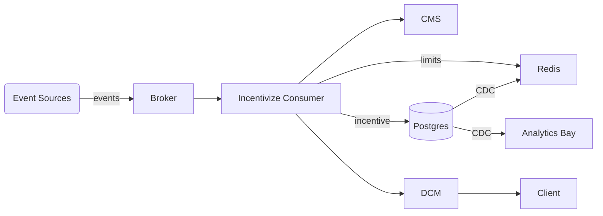

# Incentivize Platform

[](https://github.com/abhirup009/incentivize/actions)

A Kotlin/Spring Boot based **incentivization engine** that evaluates user actions against campaign rules and emits rewards in real-time. The project demonstrates:

* Rule-driven campaign evaluation with a pluggable `RuleEngineService`.
* Per-user & per-campaign limit enforcement backed by Redis counters.
* **Count-Min Sketch** (CMS) hot-campaign detection for selective aggregation & cost savings.
* Kafka ingestion pipeline for `ActionEvent`s.
* PostgreSQL (Jooq) + Redis + Flyway + Micrometer.

---

## Quick Start (Local)

### Prerequisites
* JDK 17+
* Docker & Docker Compose

```bash
# 1. Start infra
./gradlew composeUp           # spins up postgres, redis, kafka (see docker-compose.yml)

# 2. Build & run
./gradlew clean build
./gradlew bootRun

# 3. Seed rules for first five campaigns
./scripts/add_rules_to_5_campaigns.sql | \
  docker exec -i postgres psql -U incentivize -d incentivize

# 4. Fire events
TENANT=$(docker exec -i postgres psql -U incentivize -d incentivize -At -c "select tenant_id from campaign limit 1")
curl -X POST "http://localhost:8080/helper/generate?tenantId=$TENANT&action=LOGIN&count=2500"

# 5. Test WebSocket incentives (live)
#   (terminal window 1)
 npx --yes wscat -c ws://localhost:8080/ws
#   (terminal window 2)
 curl -X POST "http://localhost:8080/helper/generate?tenantId=$TENANT&action=LOGIN&count=5"
#   You should see JSON incentive messages in window 1.

# 6. Watch CMS metric (refresh every 0.2s)
watch -n0.2 curl -s http://localhost:8080/actuator/metrics/cms.hotCampaigns | jq .measurements[0].value
```

---

## Project Structure

| Path                                | Purpose                               |
|-------------------------------------|---------------------------------------|
| `src/main/kotlin/com/example`       | Application source                    |
| `src/test/kotlin`                   | Unit & integration tests              |
| `src/main/resources/db/migration`   | Flyway SQL migrations                 |
| `scripts/`                          | Helper SQL & shell scripts            |
| `memory-bank/`                      | Living documentation (architecture)   |
| `docker-compose.yml`                | Local infra stack (Postgres/Kafka/Redis) |

---

## Key Endpoints

| Method | Path | Description |
|--------|------|-------------|
| GET    | `/actuator/health`          | Liveness probe |
| GET    | `/actuator/metrics/cms.hotCampaigns` | Current hot-campaign count |
| POST   | `/helper/generate`          | Publish dummy `ActionEvent`s to Kafka |

Example generate call:
```text
POST /helper/generate?tenantId=<uuid>&action=LOGIN&count=1000
```

---

## Count-Min Sketch Hot-Campaign Flow
See [`CountMinSketchSimulation.md`](./CountMinSketchSimulation.md) for the end-to-end load-test script and analysis.

---

## Architecture Overview (from ProjectOverview.md)
Below is a condensed view of the overall system – consult [`ProjectOverview.md`](./ProjectOverview.md) and ProjectLLD for full details.

| Layer | Key Components | Responsibility |
|-------|----------------|----------------|
| **Ingestion** | *Kafka Broker* | Durable event stream of user **ActionEvent**s. |
| **Processing** | *Incentivize Consumer (IC)*, **RuleEngineService**, **LimitService** | Evaluates events against campaign **rules**, applies **limits**, generates incentives. |
| **Metadata** | *Campaign Management System (CMS)*, *Cohort Service* | CRUD for campaigns & cohorts, queried by IC at runtime. |
| **Storage** | *PostgreSQL* (relational state), *Redis* (hot counters, CMSketch), *Kafka* (CDC) | Persist incentives, limits, and hot-campaign counters. |
| **Delivery** | *Distributed Connection Manager (DCM)* | Pushes real-time incentives/notifications to clients. |
| **Analytics** | *Analytics Bay* (OLAP) | Receives CDC stream for downstream reporting. |



* Design goals: sub-500 ms latency, tenant isolation via partitioning, and horizontal scalability of IC workers.
* **Count-Min Sketch** in Redis flags surging campaigns so that IC can skip DB aggregation for hot items.

---
See [`CountMinSketchSimulation.md`](./CountMinSketchSimulation.md) for the end-to-end load-test script and analysis.

---

## Contributing
1. Fork → feature branch → PR.
2. Ensure `./gradlew test` passes.
3. Provide context in the PR description. :heart:

---

## License
MIT
